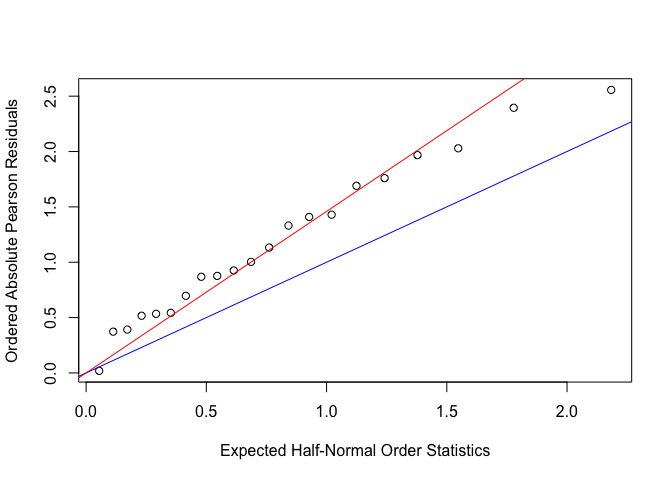

bm2_hw3
================
Roxy Zhang
2/23/2022

## Question 1

``` r
age <- rep(c(25, 35, 45, 55, 65, 75), 2)
case <- c(1, 4, 25, 42, 19, 5, 0, 5, 21, 34, 36, 8)
control <- c(9, 26, 29, 27, 18, 0, 106, 164, 138, 139, 88, 31)
exposure <- c(rep(1, 6), rep(0 , 6))

y1 <- cbind(case, control)

logit_fit = glm(y1 ~ exposure + age, family = binomial(link='logit'))

summary(logit_fit)
```

    ## 
    ## Call:
    ## glm(formula = y1 ~ exposure + age, family = binomial(link = "logit"))
    ## 
    ## Deviance Residuals: 
    ##      Min        1Q    Median        3Q       Max  
    ## -2.59974  -1.72957   0.06822   1.19015   1.50808  
    ## 
    ## Coefficients:
    ##              Estimate Std. Error z value Pr(>|z|)    
    ## (Intercept) -5.023449   0.418224 -12.011   <2e-16 ***
    ## exposure     1.780000   0.187086   9.514   <2e-16 ***
    ## age          0.061579   0.007291   8.446   <2e-16 ***
    ## ---
    ## Signif. codes:  0 '***' 0.001 '**' 0.01 '*' 0.05 '.' 0.1 ' ' 1
    ## 
    ## (Dispersion parameter for binomial family taken to be 1)
    ## 
    ##     Null deviance: 211.608  on 11  degrees of freedom
    ## Residual deviance:  31.932  on  9  degrees of freedom
    ## AIC: 78.259
    ## 
    ## Number of Fisher Scoring iterations: 4

``` r
age_group <- c(1:6) %>% 
  as.factor()
 
dummy <- dummy.code(age_group)

a1 <- rep(dummy[,1], 2)
a2 <- rep(dummy[,2], 2)
a3 <- rep(dummy[,3], 2)
a4 <- rep(dummy[,4], 2)
a5 <- rep(dummy[,5], 2)
a6 <- rep(dummy[,6], 2)

fit0 = glm(y1 ~ a1 + a2 + a3 + a4 + a5 + a6, family = binomial(link = 'logit'))

summary(fit0)
```

    ## 
    ## Call:
    ## glm(formula = y1 ~ a1 + a2 + a3 + a4 + a5 + a6, family = binomial(link = "logit"))
    ## 
    ## Deviance Residuals: 
    ##    Min      1Q  Median      3Q     Max  
    ## -3.477  -1.299   0.368   2.481   5.028  
    ## 
    ## Coefficients: (1 not defined because of singularities)
    ##             Estimate Std. Error z value Pr(>|z|)    
    ## (Intercept) -0.86904    0.33043  -2.630 0.008537 ** 
    ## a1          -3.87589    1.05728  -3.666 0.000246 ***
    ## a2          -2.18076    0.47493  -4.592 4.39e-06 ***
    ## a3          -0.42031    0.37001  -1.136 0.255977    
    ## a4           0.08778    0.35828   0.245 0.806445    
    ## a5           0.21293    0.36986   0.576 0.564812    
    ## a6                NA         NA      NA       NA    
    ## ---
    ## Signif. codes:  0 '***' 0.001 '**' 0.01 '*' 0.05 '.' 0.1 ' ' 1
    ## 
    ## (Dispersion parameter for binomial family taken to be 1)
    ## 
    ##     Null deviance: 211.608  on 11  degrees of freedom
    ## Residual deviance:  90.563  on  6  degrees of freedom
    ## AIC: 142.89
    ## 
    ## Number of Fisher Scoring iterations: 6

``` r
fit0$deviance
```

    ## [1] 90.5632

``` r
fit1 = glm(y1 ~ exposure + a1 + a2 + a3 + a4 + a5 + a6, family = binomial(link = 'logit'))

summary(fit1)
```

    ## 
    ## Call:
    ## glm(formula = y1 ~ exposure + a1 + a2 + a3 + a4 + a5 + a6, family = binomial(link = "logit"))
    ## 
    ## Deviance Residuals: 
    ##        1         2         3         4         5         6         7         8  
    ##  0.96641  -0.05538   0.13652   0.45905  -1.59342   2.11053  -1.16129   0.04747  
    ##        9        10        11        12  
    ## -0.11628  -0.35391   0.96513  -0.67850  
    ## 
    ## Coefficients: (1 not defined because of singularities)
    ##              Estimate Std. Error z value Pr(>|z|)    
    ## (Intercept) -1.092158   0.344216  -3.173 0.001509 ** 
    ## exposure     1.669890   0.189602   8.807  < 2e-16 ***
    ## a1          -3.962190   1.065035  -3.720 0.000199 ***
    ## a2          -2.419896   0.491328  -4.925 8.43e-07 ***
    ## a3          -0.763428   0.389837  -1.958 0.050192 .  
    ## a4          -0.248700   0.376735  -0.660 0.509161    
    ## a5           0.004692   0.387043   0.012 0.990328    
    ## a6                 NA         NA      NA       NA    
    ## ---
    ## Signif. codes:  0 '***' 0.001 '**' 0.01 '*' 0.05 '.' 0.1 ' ' 1
    ## 
    ## (Dispersion parameter for binomial family taken to be 1)
    ## 
    ##     Null deviance: 211.608  on 11  degrees of freedom
    ## Residual deviance:  11.041  on  5  degrees of freedom
    ## AIC: 65.369
    ## 
    ## Number of Fisher Scoring iterations: 5

``` r
fit1$deviance
```

    ## [1] 11.04118

## Question 2

``` r
extract = c(rep(1, 5), rep(0, 6), rep(1, 5), rep(0,5))
seed = c(rep(1, 11), rep(0, 10))

germination = c(10, 23, 23, 26, 17, 5, 53, 55, 32, 46, 10, 8, 10, 8, 23, 0, 3, 22, 15, 32, 3)
batch = c(39, 62, 81, 51, 39, 6, 74, 72, 51, 79, 13, 16, 30, 28, 45, 4, 12, 41, 30, 51, 7)

seed_fit = glm(cbind(germination, batch - germination) ~ extract + seed, family = binomial(link = 'logit'))

summary(seed_fit)
```

    ## 
    ## Call:
    ## glm(formula = cbind(germination, batch - germination) ~ extract + 
    ##     seed, family = binomial(link = "logit"))
    ## 
    ## Deviance Residuals: 
    ##     Min       1Q   Median       3Q      Max  
    ## -2.3919  -0.9949  -0.3744   0.9831   2.4766  
    ## 
    ## Coefficients:
    ##             Estimate Std. Error z value Pr(>|z|)    
    ## (Intercept)   0.3643     0.1428   2.550   0.0108 *  
    ## extract      -1.0647     0.1442  -7.383 1.55e-13 ***
    ## seed          0.2705     0.1547   1.748   0.0804 .  
    ## ---
    ## Signif. codes:  0 '***' 0.001 '**' 0.01 '*' 0.05 '.' 0.1 ' ' 1
    ## 
    ## (Dispersion parameter for binomial family taken to be 1)
    ## 
    ##     Null deviance: 98.719  on 20  degrees of freedom
    ## Residual deviance: 39.686  on 18  degrees of freedom
    ## AIC: 122.28
    ## 
    ## Number of Fisher Scoring iterations: 4

``` r
seed_fit$deviance
```

    ## [1] 39.68589

``` r
# pearson chisq
sum(residuals(seed_fit,type='pearson')^2)
```

    ## [1] 38.31062

``` r
# dispersion parameter
g = sum(residuals(seed_fit,type='pearson')^2)

phi = g / (21 - 3)

tilde_phi = seed_fit$deviance / seed_fit$residual
```

``` r
# half-normal plot
residual = residuals(seed_fit,type='pearson')

plot(qnorm((21+1:21+0.5)/(2*21+1.125)),sort(abs(residual)),
     xlab = 'Expected Half-Normal Order Statistics',
     ylab = 'Ordered Absolute Pearson Residuals')
     
abline(a = 0, b = 1, col = 'blue')
abline(a = 0, b = sqrt(phi), col = 'red')
```

<!-- -->

``` r
# fit model with constant over-dispersion
summary(seed_fit, dispersion = phi)
```

    ## 
    ## Call:
    ## glm(formula = cbind(germination, batch - germination) ~ extract + 
    ##     seed, family = binomial(link = "logit"))
    ## 
    ## Deviance Residuals: 
    ##     Min       1Q   Median       3Q      Max  
    ## -2.3919  -0.9949  -0.3744   0.9831   2.4766  
    ## 
    ## Coefficients:
    ##             Estimate Std. Error z value Pr(>|z|)    
    ## (Intercept)   0.3643     0.2084   1.748   0.0804 .  
    ## extract      -1.0647     0.2104  -5.061 4.18e-07 ***
    ## seed          0.2705     0.2257   1.198   0.2308    
    ## ---
    ## Signif. codes:  0 '***' 0.001 '**' 0.01 '*' 0.05 '.' 0.1 ' ' 1
    ## 
    ## (Dispersion parameter for binomial family taken to be 2.128368)
    ## 
    ##     Null deviance: 98.719  on 20  degrees of freedom
    ## Residual deviance: 39.686  on 18  degrees of freedom
    ## AIC: 122.28
    ## 
    ## Number of Fisher Scoring iterations: 4

``` r
# goodness of fit
1 - pchisq(seed_fit$deviance/phi, 21-3)
```

    ## [1] 0.4139097
